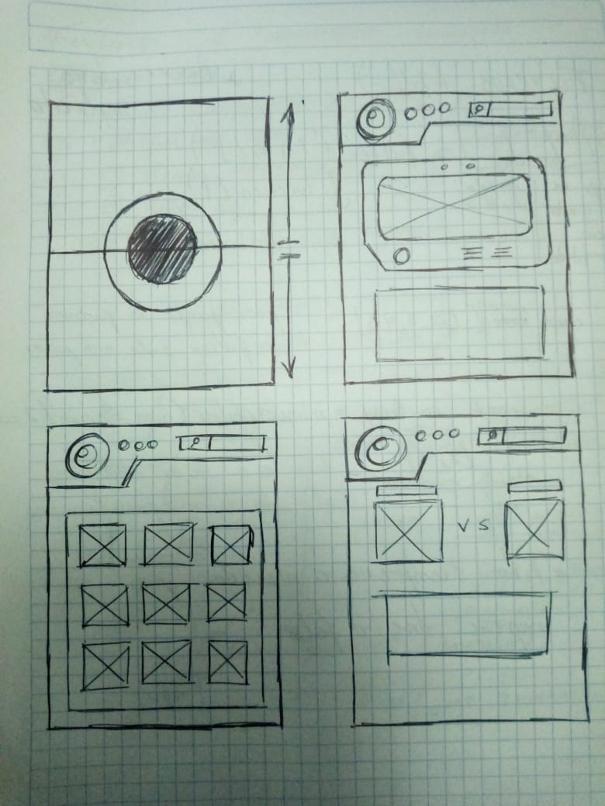
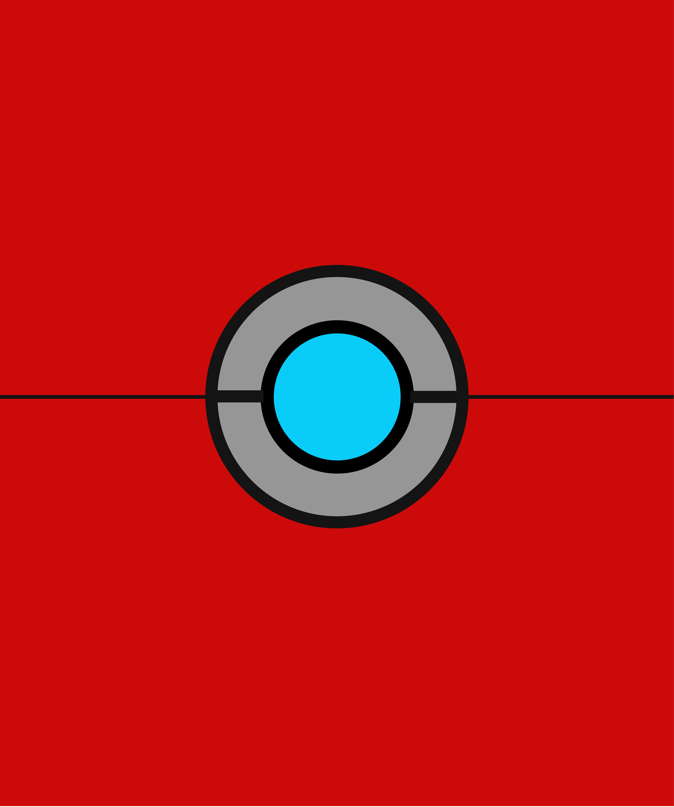
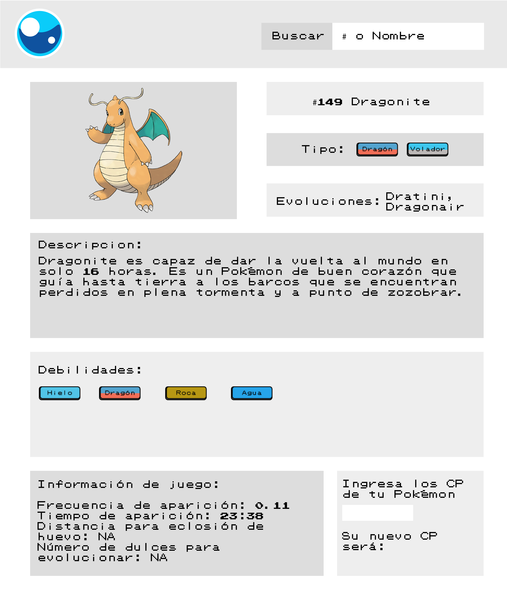
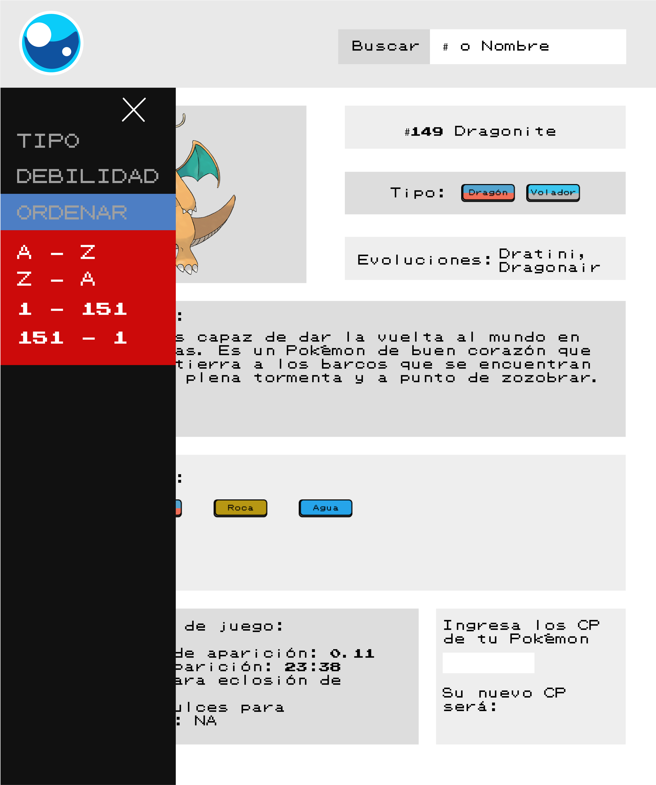
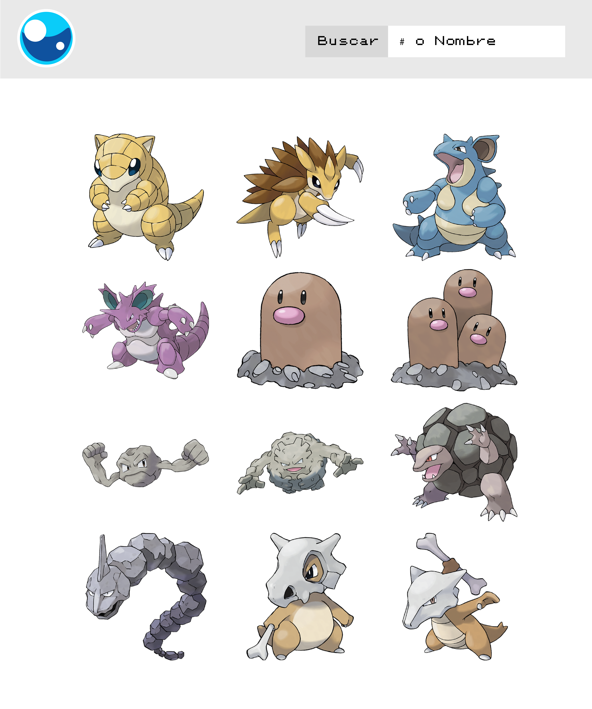

# Pokédex Go!

Nuestro proyecto, llamado Pokédex Go, se basa en la mini computadora que se dedicaba a catalogar la información correspondiente de los varios tipos de Pokémon que existía en la serie/manga y en especial presentando información relevante a la app Pokémon Go.

## Definición del Producto

La Pokédex Go está enfocada para usuarios que ya disfrutan de jugar la app de Pokémon Go pero que no están familiarizados con la primera generación que fue introducida en 1996 y necesitan hacer consultas de información referente al juego. 

```
Por ejemplo: 

- Jugadores jóvenes de 8 a 15 años que no disponen de un plan de datos mensual como para hacer consultas en tiempo real en el juego.

- Jugadores mayores que sí disponen de un plan de datos mensual pero que no están familiarizados con la primera generación de Pokémon.
```

### Funciones del proyecto

- Presenta un Pokémon al azar al principio para ir familiarizando al usuario con la 1 gen.

- Busca un Pokémon específico por nombre o número.

- Filtrar Pokémon por tipo/debilidades.

- Presentar la lista completa de Pokémon y ordenarla por Nombre/Número en orden ascendente o descendente.

Una vez que hemos elegido un Pokémon en específico, se presenta la siguiente información:

```
- Número / Nombre del Pokémon
- Tipo [cada imagen funciona como botón y nos permite filtrar por pokemon de tipo similar]
- Evoluciones (si las tiene)
- Descripción
- Debilidades [igual que en tipo, las imágenes funcionan como botones para poder filtrar por pokemon cuyo tipo concuerda con la imagen seleccionada]

- Información del juego Pokémon Go 
    + Frecuencia de aparición.
    + Tiempo de aparición.
    + Distancia para eclosión de huevos (sólo el pokémon nace desde un huevo).
    + Número de caramelos necesarios para evolucionar.

- Calculador de evolución:
    + El usuario ingresa los PC (Puntos de Combate) del Pokémon y la calculadora le muestra un estimado de sus nuevos PC al evolucionar. 

    Esta función es especialmente útil cuando se tienen varios Pokémon del mismo nombre y así poder saber en cuál es mejor gastar sus caramelos para evolucionar

```
### Historias de usuario

* La usuaria necesita dar click en la pantalla de inicio para llevarla a la interfaz de la Pokédex donde se le muestra un Pokémon aleatorio.

* La usuaria necesita una barra de búsqueda para filtrar el Pokémon del que quiera ver la información ( # o nombre)

* La usuaria necesita un menú que le permita filtrar Pokémon por tipo o debilidad y ordenar por número o nombre de manera ascendente o descendente

### Definition of Done

- Muestra un Pokémon al azar al entrar a la página.

- Permite buscar un Pokémon específico usando su nombre o número.

- Tiene un menú que permite filtrar y ordenar los Pokémon con los criterios ya mencionados.

- Incluye una calculadora para predecir los Puntos de Combate al evolucionar a un Pokémon.

# Diseño de la Interfaz de Usuario (UI)
## Prototipo de baja fidelidad


## Prototipo de alta fidelidad

  

  


### Cambios de interfaz

Al principio pensamos en una interfaz similar a la primera Pokédex, tomando como referencia la que salía en la primera serie animada, sin embargo después nos decidimos por un estilo más minimalista con algunos elementos retro a fin de llegar a un punto medio entre los usuarios que pueden ser jóvenes y los adultos.

También se hizo un cambio respecto a la funcionalidad extra de la Pokédex: Al principio pensábamos en usar un calculador de batalla en donde el usuario eligiera dos Pokémon para saber cuál era más probable de ganar la batalla, sin embargo al final decidimos usar la calculadora por ser mucho más práctica en el juego y usar la data disponible de manera clara.

## Problemas encontrados a través de los tests de usabilidad

+ Al principio escribimos todo el código en la carpeta main.js y al intentar correr los tests nos encontramos con que habían varias funciones que no corrían bien porque deberían de estar en data.js así que tuvimos que reescribir éstas funciones para solucionarlo.

## Construida con

* Visual Studio Code
* Adobe Illustrator

## Autoras

* Mel Quesada
* Share Azcárraga

## Agradecimientos

* A todos los tutoriales y artículos sobre CSS que ayudaron a crear este proyecto.

* A todas nuestras compañeras por la inspiración y la colaboración.

* A todo el Equipo Laboratoria por su ayuda, guía y paciencia. 